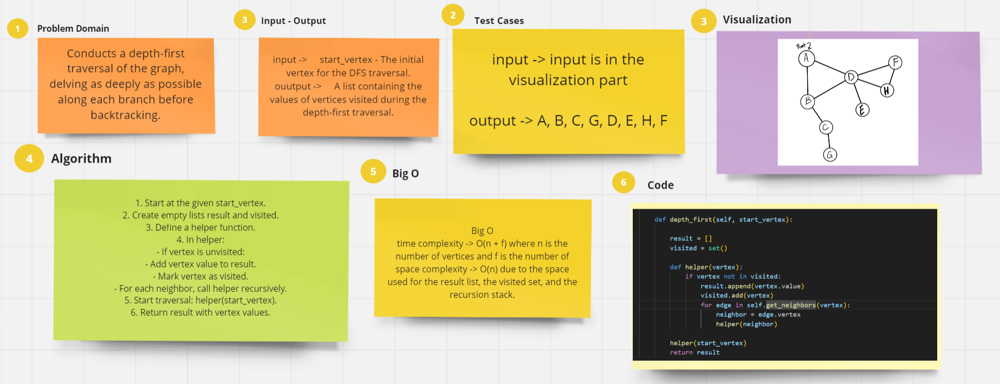

# graph depth first

Conducts a depth-first traversal of the graph, delving as deeply as possible along each branch before backtracking.

------

## Whiteboard Process

## Approach & Efficiency

**Time Complexity:** O(n + f) where n is the number of vertices and f is the number of 

**Space Complexity:** O(n) due to the space used for the result list, the visited set, and the recursion stack.