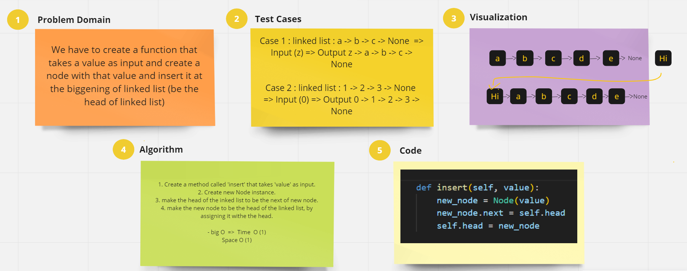
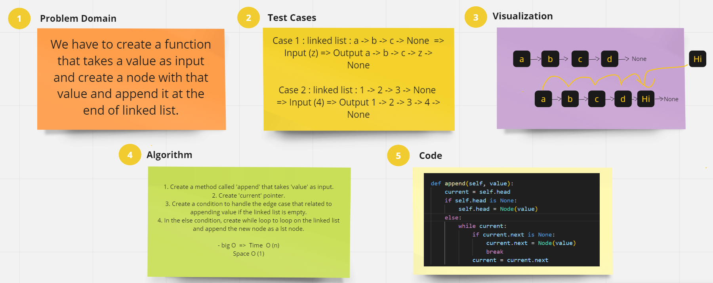
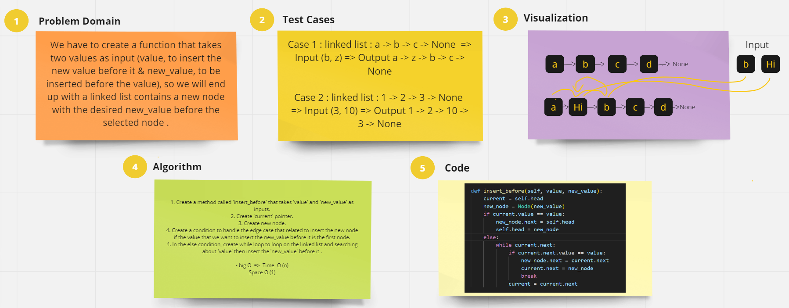
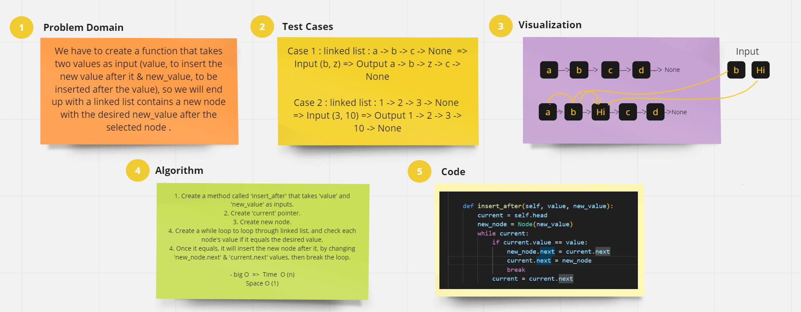
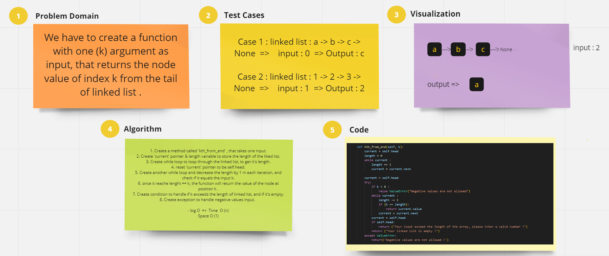
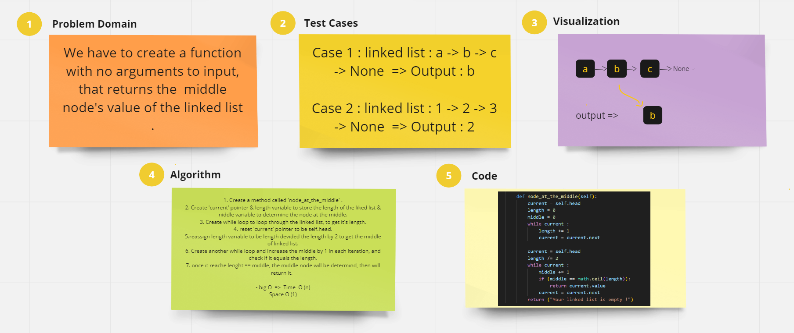

# Linked Lists Implementation

An implementation of Singly Linked Lists using classes, with multiple methods that do some functionalities on the linked list instances, and building tests to check them.

## Whiteboard Process

### insert

------

### append

-------

### insert before

-------

### insert after

-------

### kth from end

-------

### node at the middle

