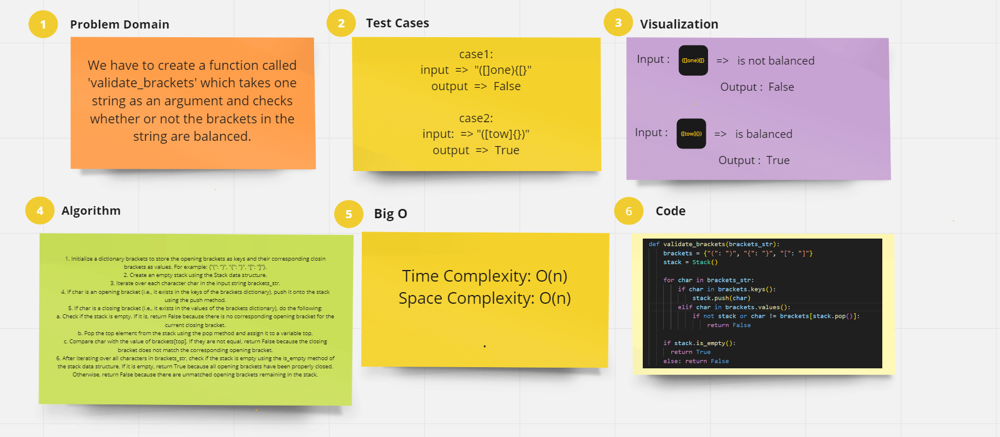

# Stack-Queue Brackets

Implementing a function that takes a string as an argument and checks whether or not the brackets in the string are balanced

## Whiteboard Process :

## How to run the code :

Write in the terminal => python3 -m stack-queue-brackets.stack_queue_brackets