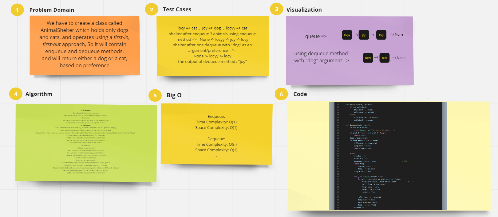

# Stack-queue-animal-shelter

Implementing First-in, First out Animal Shelter that returns either a dog or a cat, based on preference.

## Whiteboard Process :

## How to run the code :

Write in the terminal => python3 -m stack_queue_animal_shelter.animal_shelter